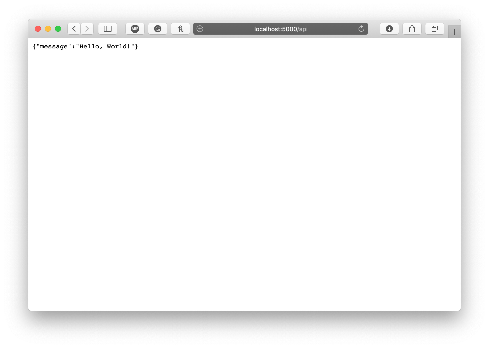

# python-flask-helloworld

Simple Hello World App using Flask!

## Prerequisites

- Python >= 3.6

## Run Application

### Create Virtual Environment for Application

Run the following command to create a new Python Virtual Environment for running this application:

```bash
python3 -m venv fask_test_venv
```

***Note:* Creation of Virtual Environment needs to be only done once when this repository is downloaded.


### Activate Virtual Environment

Run the following command to activate the created Virtual Environment:

```bash
source fask_test_venv/bin/activate
```

**Note:** This needs to run each time the application needs to be run in a terminal

### Install pip dependencies

Run the following command to run to install dependencies of this application into the Virtual Environment:

```
pip3 install -r requirements.txt
```

### Add additional pip dependencies

Run the following commands to add a new pip dependencies to this application. The command below show the example of installing `flask` package.

```
pip3 install flask
echo 'flask' >> requirements.txt
pip3 install -r requirements.txt
pip3 freeze > requirements.txt
```

### Running Application

Run the application by running the following commands:
```
export FLASK_APP=src/hello_world_app/app.py
flask run
```

## Test

Go to the following url to view the api responses:

[http://localhost:5000/](http://localhost:5000/)


[http://localhost:5000/api/](http://localhost:5000/api/) 



## Cleanup


Stop the application by running `Command + c` 
 
Run the following commands to exit from the activated Virtual Environment:

```bash
deactivate
```

## Useful Links

- https://flask.palletsprojects.com/en/1.1.x/quickstart/
